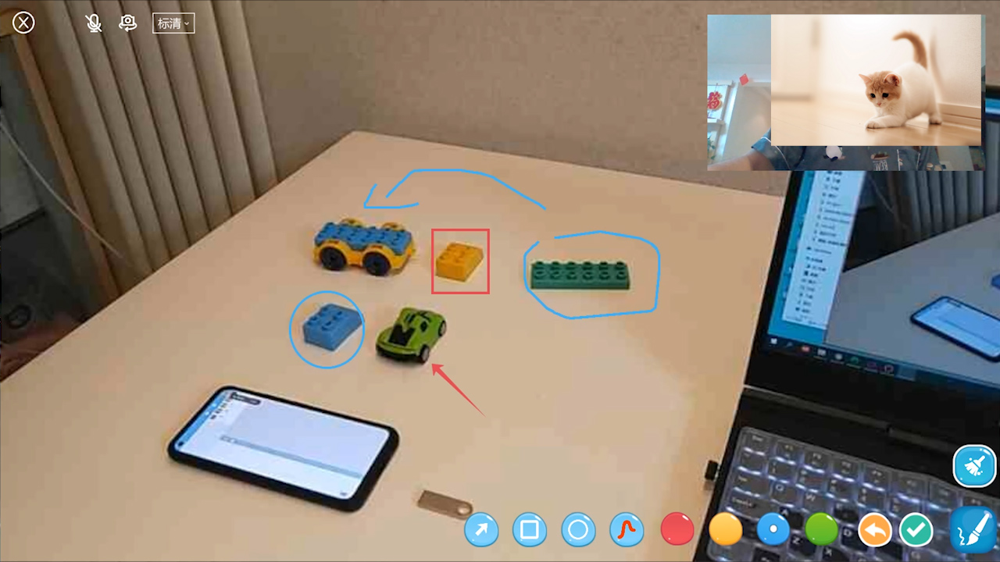
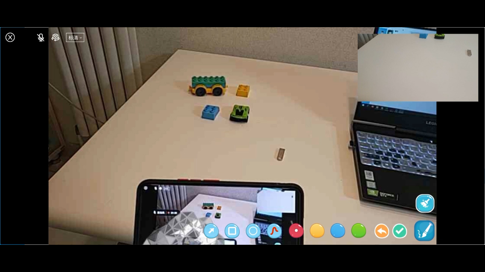
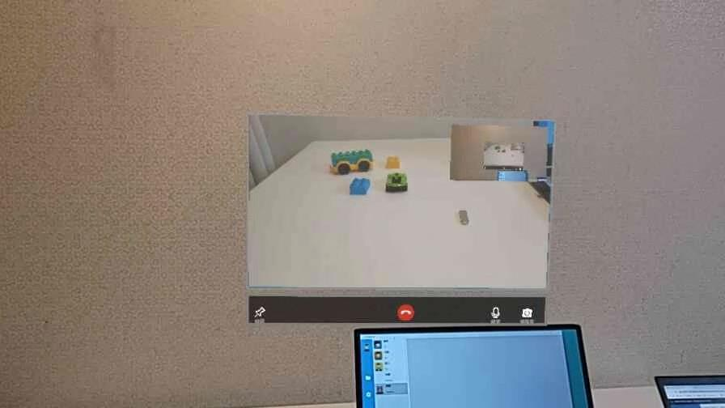
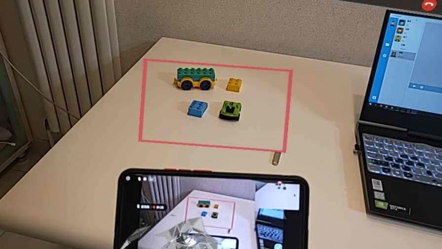

# Hololens RemoteMark

[**中文**](README.md) ｜ *English*

## Introduce
RemoteMark is a software that supports Hololens, Android and PC video communication and supports space annotation  [Remote Assist](https://docs.microsoft.com/en-us/dynamics365/mixed-reality/remote-assist/ra-overview)

###Screenshot of video communication between PC and Hololens

###PC Chat screenshot

###Screenshot of Android and Hololens video communication

###Hololens Video communication screenshot

##Operating conditions

###1.Run XRChatServer.exe，must be install MySQL database on local computer, and create database: chatsql, password: 123456. Then import account.dbf in the tools folder into the database.

###2、Run the server first and then the PC and Hololens client.
##Other instructions
###1、The demo project only includes PC and Hololens, not include Android. If you need an official version, please contact 1053050442@qq.com
