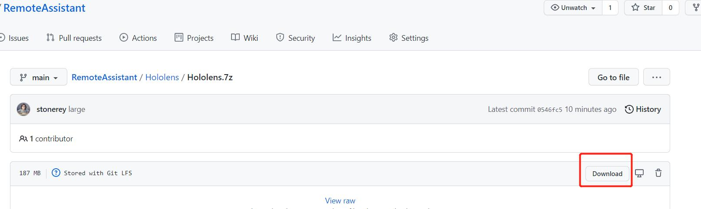

# Hololens RemoteMark

[**中文**](README.md) ｜ *English*

## Introduce
RemoteMark is a software that supports Hololens, Android and PC video communication and supports space annotation  [Remote Assist](https://docs.microsoft.com/en-us/dynamics365/mixed-reality/remote-assist/ra-overview)

#### Video: https://youtu.be/fa6ECxv6nKk
#### Screenshot of video communication between PC and Hololens

#### PC Chat screenshot

#### Screenshot of Android and Hololens video communication

#### Hololens Video communication screenshot

## Operating conditions

#### 1. To run the server XRChatServer.exe, install the MySQL 8.0.18 database or earlier on the local computer and create the database chatsql with the password 123456. Port: 3306. Then import account.dbf from the tools folder into the database. UserAvatar Enter your own user avatar address in the data table. You can also use [HFS File Server] (https://www.rejetto.com/hfs/?f=intro) in the local head is set the address.

#### 2. If the Charater set utfmb3 error occurs, install mysql 8.0.18 database version or earlier.

 

#### 2、Run the server first and then the PC and Hololens client.
#### 3、Hololens.7z  file is large ，requires installation git lfs:https://git-lfs.github.com Or download it manually

## Other instructions
#### 1.If you need an official version, please contact 1053050442@qq.com
